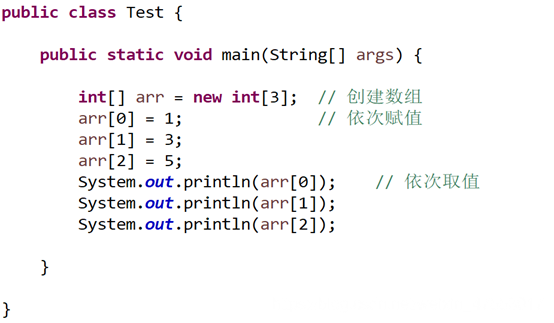
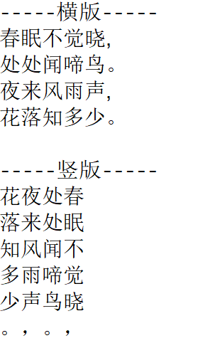

# 4.数组


如果我们需要存储大量的数据，比如存储100名学生的成绩，这就要重复声明100个变量；再比如让100名学生的成绩全部加一，也是100个变量重复操作，这样太麻烦过于繁琐重复操作过多，无法进行统一的操作。
## 4.1数组的概念
一组连续的存储空间，存储多个相同数据类型的值。同一种类型数据的集合。其实数组就是一个容器。运算的时候有很多数据参与运算,那么首先需要做的是什么.不是如何运算而是如何保存这些数据以便于后期的运算，那么数组就是一种用于存储数据的方式，能存数据的地方我们称之为容器，容器里装的东西就是数组的元素, 数组可以装任意类型的数据，虽然可以装任意类型的数据,但是定义好的数组只能装一种元素， 也就是数组一旦定义，那么里边存储的数据类型也就确定了。
特点：类型相同，长度固定，可以自动给数组中的元素从0开始编号，方便操作这些元素。


##  4.2 数组的定义
- 数组的创建：

> 元素类型[] 数组名 = new 元素类型[元素个数或数组长度];


-	声明数组变量
必须在程序中声明数组，并指定数据类型；声明数据类型为int，容器使用数组那么如何标识数组呢？在java中我们使用[]符号标识，然后接着是定义数组的名称为arr，格式为 int[] arr。注意：int x[] 也是一种创建数组的格式。推荐使用int[] x 的形式声明数组。

- 创建数组
要使用一个新的关键字叫做new，new 用来在内存中产生一个容器实体，数据要存储是需要有空间的，存储很多数据的空间用new 操作符来开辟，new int[5]; 这个5是元素的个数。右边这部分就是在内存中定义了一个真实存在的数组，能存储5个元素。注意：new int[5] 做了两件事情，首先使用new int[3] 创建了一个数组，然后把这个数组的引用赋值给数组变量x。

==思考：== arr是属于什么数据类型？
任何一个变量都得有自己的数据类型。注意这个arr不是int 类型的 。int 代表的是容器里边元素的类型。那么x 是数组类型的，数组是一种单独的数据类型。数据类型分为2大派，分为基本数据类型和引用数据类型。 第二大派是引用数据类型。那么大家现在已经接触到了引用数据类型三种当中的一种。就是数组类型 [] 中括号就代表数组。


==思考：== int[] arr = new int[5];在内存中发生了什么？
内存任何一个程序,运行的时候都需要在内存中开辟空间.int[] arr = new int[5]; 这个程序在内存中是什么样?这就涉及到了java虚拟机在执行程序时所开辟的空间,那么Java开辟启动了多少空间呢？在后面我们会深入介绍。
定义数组主要有两种格式：
格式一：

```java
元素类型[] 数组名 = new 元素类型[元素个数或数组长度]; 
示例：int[] arr1 = new int[5];
示例：float[] arr2 = new float[5];
```
格式二：

```java
元素类型[] 数组名 = new 元素类型[]{元素，元素，……}; 
int[] arr1 = new int[]{3,5,1,7}; 
float[] arr2 = {1.3,1.5,1.1,1.7};
```
==注意：== 给数组分配空间时，必须指定数组能够存储的元素个数来确定数组大小，体现了数组长度固定的特点；创建数组之后不能修改数组的大小。可以使用length 属性获取数组的大小。

## 4.3 数组的初始化
 - 数组的声明与赋值


```java
int[] arr = new int[2];
arr[0] = 10;
arr[1] = 20;
```
另一种方式也可以直接明确数组的长度,以及数组中元素的内容：

```java
int[] arr = new int[]{20,30,40};
int[] arr = {20,30,40};
```
如果数组初始化中不使用运算符new。需要注意：下列写法是错误的：

```java
int[] arr; 
arr = {20,30,40};
```
初始化数组，必须将声明，创建，初始化都放在一条语句中个，分开会产生语法错误。


## 4.4 数组下标的有效范围与常见异常

- ArrayIndexOutOfBoundsException 索引值越界异常。
我们进行了数组声明、赋值和访问之后，下面我们来讨论一下数组下标的有效范围。如下面一个例子中：

我们发现长度为5的数组，再给每一个有效的元素依次赋值，再然后完成访问。但是在访问过程中，arr[3]是较为特殊的，那我们就要明确对于一个数组来见，有效的下标范围是0 ~ 数组长度-1，也就是说作为一个长度为三的数组来讲，有效下标范围应该是0 ~ 2，一旦我们访问了不在有效范围的下标，那么就会产生数组下标越界异常。

> Exception in thread "main" java.lang.ArrayIndexOutOfBoundsException:
> Index 3 out of bounds for length 3


-	NullPointerException 空指针异常
引用类型变量没有指向任何对象，而访问了对象的属性或者是调用了对象的方法。


## 4.5 数组内存分析

-	栈内存：栈内存存储的都是局部变量，变量一旦出了自己的作用域，那么就会马上从内存的消失，释放内存空间。

-	堆内存：堆内存存储的都是对象内存，对象一旦被使用完，并不会马上从内存中消失，而是等待垃圾回收器不定时的把垃圾对象回收，这时候该对象才会消失，释放内存。

-	凡是以new关键字创建的对象，JVM都会在堆内存中开辟一个新的空间，创建一个新的对象。
-	对象如果没有变量引用了，那么该对象就是一个垃圾对象了。


**双数组的内存分析**

```java
public class Test2 {
    public static void main(String[] args) {
        int[] arr1 = new int[2];
        int[] arr2 = new int[3];
        System.out.println(arr1);
        System.out.println(arr1[0]);
        System.out.println(arr1[1]);
 
        System.out.println(arr2);
        System.out.println(arr2[0]);
        System.out.println(arr2[1]);
        System.out.println(arr2[2]);
 
        // 给arr1数组的索引为0元素赋值100
        arr1[0] = 100;
        // 给arr2数组的索引为0元素赋值200
        arr2[0] = 200;
 
        System.out.println("-----------");
        System.out.println(arr1);
        System.out.println(arr1[0]);
        System.out.println(arr1[1]);
 
        System.out.println(arr2);
        System.out.println(arr2[0]);
        System.out.println(arr2[1]);
        System.out.println(arr2[2]);
    }
}

```

## 4.6 二维数组

我们有个酒店500个房间，并且所有房间都在同一个楼层里，那么拿到499号房钥匙的旅客可能就不高兴了，从1号房走到 499号房要花好长时间，因此每个酒店都不只有一个楼层，而是很多楼层，每一个楼层都会有很多房间，形成一个立体的结构，把大量的房间均摊到每个楼层，这种结构就是二维表结构。在计算机中，二维表结构可以使用二维数组来表示。使用二维表结构表示快捷酒店每一个楼层的房间号的效果如下图所示。


###  4.6.1 创建二维数组
二维数组可以看作是特殊的一维数组，它有两种声明方式：

```java
数组元素类型 数组名字[][];
数组元素类型[][] 数组名字;
int arr1[][]; 
char[][] arr2;
```
同一维数组一样，二维数组在声明时也没有分配内存空间，同样要使用关键字**new**来分配内存，然后才可以访问每个元素。
为二维数组分配内存有两种方式∶

```java
int a[][];
a = new int[2][4];  //直接分配行类
int b[][];
b = new int[2][];   //先分配行，再分配列
b[0] = new int[2];  //给第一行分配列
b[1] = new int[2];  //给第二行分配列
```
==注意：== 创建二维数组的时候，可以只声明"行"的长度，而不声明"列"的长度，例如∶

```java
int a[][] = new int[2][]; //可省略列的长度
```
但如果不声明"行"数量的话，就是错误的写法，例如∶

```java
// 错误写法!

int b[][] = new int[][];

// 错误写法!

int c[][] = new int[][2];
```

###  4.6.2 二维数组的赋值
二维数组的初始化方法与一维数组类似，也有3种方式。但不同的是，二维数组有两个索引（即下标），构成由行和列组成的一个矩阵。

**使用三种方式初始化二维数组**

```java
public class InitTDArray {
	public static void main(String[] args) {
		/* 第一种方式 */
		int tdarr1[][] = { { 1, 3, 5 }, { 5, 9, 10 } };
		/* 第二种方式 */
		int tdarr2[][] = new int[][] { { 65, 55, 12 }, { 92, 7, 22 } };
		/* 第三种方式 */
		int tdarr3[][] = new int[2][3]; // 先给数组分配内存空间
		tdarr3[0] = new int[] { 6, 54, 71 }; // 给第一行分配一个一维数组
		tdarr3[1][0] = 63; // 给第二行第一列赋值为63
		tdarr3[1][1] = 10; // 给第二行第二列赋值为10
		tdarr3[1][2] = 7; // 给第二行第三列赋值为7
	}
}

```
从这个例子可以看出，二维数组每一个元素也是一个数组，所以第一种直接赋值方式，在大括号内还有大括号，因为每一个元素都是一个一维数组;第二种使用 new 的方法与一维数组类似; 第三种比较特殊，在分配内存空间之后，还有两种赋值的方式，给某一行直接赋值一个一维数组，或者给某一行的每一个元素分别赋值。开发者可以根据使用习惯和程序要求灵活地选用其中一种赋值方式。

###  4.6.3 多维数组
比一维数组维数高的叫多维数组，理论上二维数组也属于多维数组。Java也支持三维、四维等多维数组，创建其他多维数组的方法与创建二维数组类似。

```java
int a[][][] = new int[3][4][5];
//创建三维数组

char b[][][][] = new char[6][7][8][9];
//创建四维数纹

double c[][][][][]= new double[10][11][12][13][14]; // 建wu维数组
```
==注意：== 多维数组在Java中是可以使用的，但因为其结构关系太过于复杂，容易出错，所以不推荐在程序中使用比二维数组更高维数的数组，如果需要存储复杂的数据，推荐使用集合类或自定义类集合类包括List、Map等，这些集合类感兴趣的小伙伴可以了解一下。

### 4.6.4 通过二维数组输出不同版式的古诗
创建Poetry类，声明一个字符型二维数组，将古诗《春晓》的内容赋值于二维数组，然后分别用横版和竖版两种方式输出，实例代码如下∶

```java
public class Poetry {
	public static void main(String[] args) {
		char arr[][] = new char[4][]; // 创建一个4行的二维数组
		arr[0] = new char[] { '春', '眠', '不', '觉', '晓' }; // 为每一行赋值
		arr[1] = new char[] { '处', '处', '闻', '啼', '鸟' };
		arr[2] = new char[] { '夜', '来', '风', '雨', '声' };
		arr[3] = new char[] { '花', '落', '知', '多', '少' };
		/* 横版输出 */
		System.out.println("-----横版-----");
		for (int i = 0; i < 4; i++) { // 循环4行
			for (int j = 0; j < 5; j++) { // 循环5列
				System.out.print(arr[i][j]); // 输出数组中的元素
			}
			if (i % 2 == 0) {
				System.out.println(","); // 如果是一、三句，输出逗号
			} else {
				System.out.println("。"); // 如果是二、四句，输出句号
			}
		}
		/* 竖版输出 */
		System.out.println("\n-----竖版-----");
		for (int j = 0; j < 5; j++) { // 列变行
			for (int i = 3; i >= 0; i--) { // 行变列，反序输出
				System.out.print(arr[i][j]); // 输出数组中的元素
			}
			System.out.println(); // 换行
		}
		System.out.println("。，。，"); // 输出最后的标点
	}
}

```
输出结果如下：

## 4.7 不规则数组

上文讲的数组都是行、列固定的矩形方阵， Java同时也支持不规则的数组，例如二维数组中，不同行的元素个数可以不同，例如∶

```java
a[][] = new int[3][];
// 创建二维数组，指定行数，不指定列数
a[0]= new int[5];// 第一行分配5个元素

a[1] = new int[3];// 第二行分配3个元素
a[2] = new int[4];// 第三行分配4个元素
```
这个不规则二维数组所占的空间如图所示。


输出不规则二维数组中的所有元素

创建IrregularArrax类，声明一个不规则二维数组，输出数组每行的元素个数及各元素的值，代码如下∶
```java
public class IrregularArray {
	public static void main(String[] args) {
		int a[][] = new int[3][]; // 创建二维数组，指定行数，不指定列数
		a[0] = new int[] { 52, 64, 85, 12, 3, 64 }; // 第一行分配5个元素
		a[1] = new int[] { 41, 99, 2 }; // 第二行分配3个元素
		a[2] = new int[] { 285, 61, 278, 2 }; // 第三行分配4个元素
		for (int i = 0; i < a.length; i++) {
			System.out.print("a[" + i + "]中有" + a[i].length + "个元素，分别是：");
			for (int tmp : a[i]) { // foreach循环输出数字中元素
				System.out.print(tmp + " ");
			}
			System.out.println();
		}
	}
}
```
## 4.8 数组的基本操作

### 4.8.1 数组遍历

遍历数组就是获取数组中的每个元素。通常遍历数组都是使用for循环来实现。遍历一维数组很简单，也很好理解，下面详细介绍遍历二维数组的方法。


遍历二维数组需使用双层for循环，通过数组的length属性可获得数组的长度。

创建Trap类，定义二维数组，实现将二维数组中的每一个元素按照行、列格式进行输出，代码如下∶

```java
public class Trap {
	public static void main(String[] args) {
		int b[][] = new int[][] { { 1 }, { 2, 3 }, { 4, 5, 6 } }; // 定义二维数组
		for (int k = 0; k < b.length; k++) { // 循环遍历二维数组中第一个索引
			for (int c = 0; c < b[k].length; c++) { // 循环遍历二维数组中第二个索引
				System.out.print(b[k][c]); // 将数组中的元素输出
			}
			System.out.println(); // 输出换行
		}
	}
}
```

本实例中有一个语法需要掌握∶ 如果有一个二维数组a[][]，a.length返回的是数组的行数，a[0]. length返回的是第一行的列数量，a[1].length返回的是第二行的列数量。同理，a[n]返回的是第n+1行的列数量，由于二维数组可能是不规则数组，所以每一行的列数量可能不相同，因此在遍历二维数组时，最好使用数组的length属性控制循环次数，而不是用某他变量或常量。

**练一练：使用二维数组实现杨辉三角算法。**

```java
public class YangHui {// 杨辉三角算法的实现
	public static void main(String[] args) {
		// 定义一个长度为10的二维数组
		int[][] Array_int = new int[10][];
		// 向数组中记录杨辉三角形的值
		for (int i = 0; i < Array_int.length; i++) {// 遍历行数
			Array_int[i] = new int[i + 1];// 定义二维数组的列数
			// 遍历二维数组的列数
			for (int j = 0; j < Array_int[i].length; j++) {
				if (i <= 1) {// 如果是数组的前两行
					Array_int[i][j] = 1;// 将其设置为1
					continue;
				} else {
					// 如果是行首或行尾
					if (j == 0 | j == Array_int[i].length - 1)
						Array_int[i][j] = 1;// 将其设置为1
					else// 根据杨辉算法进行计算
						Array_int[i][j] = Array_int[i - 1][j - 1] + Array_int[i - 1][j];
				}
			}
		}
		for (int i = 0; i < Array_int.length; i++) {// 输出杨辉三角
			for (int j = 0; j < Array_int[i].length; j++)
				System.out.print(Array_int[i][j] + "\t");
			System.out.println();
		}
	}
}
```

运行结果如下：


###  4.8.2 填充和替换数组元素
数组中的元素定义完成后，可通过Arrays类的静态方法fill()方法来对数组中的元素进行分配，起到填充和替换的效果。fill()方法可将指定的int值分配给int型数组的每个元素。
语法如下∶

> Arrays.fill()(int[] a ,int value)

a∶要进行元素分配的数组。
value∶要存储数组中所有元素的值。

**使用 **fill()** 方法将空数组填满数值**

创建 Swap类，通过fill()方法填充数组元素，最后将数组中的各个元素输出，代码如下∶ 
```java
import java.util.Arrays; //导入java.util.Arrays类

public class Swap {
	public static void main(String[] args) {
		int arr[] = new int[5]; // 创建int型数组
		Arrays.fill(arr, 8); // 使用同一个值对数组进行填充
		for (int i = 0; i < arr.length; i++) { // 循环遍历数组中的元素
			// 将数组中的元素依次输出
			System.out.println("第" + i + "个元素是：" + arr[i]);
		}
	}
}
```
#  总结
- 为什么数组的索引从0开始？
为什么索引是从0开始的，而不是从1开始呢？这是继承了汇编语言的传统，从0开始更利于计算机做二进制的运算和查找。

- 数组长度使用length属性获得，但实际上这个属性只能表示一个一维数组的长度。二维数组使用length属性的方式，其实是将二维数组转为"一维数组[一维数组下]"的形式，即一维数组中的元素仍然是一个一维数组，所以二维数组在遍历时使用的两个length并不是同一个数组的属性。
- 本章介绍的是数组的创建及使用方法。需要注意的是数组的下标是从0开始，最后一个元素的下标总是"**数组名 .length-1**"。本章的重点是创建数组、给数组赋值以及读取数组中元素的值。此外，Arrays类还提供了其他操作数组的方法，有兴趣的读者可以查阅相关资料。
