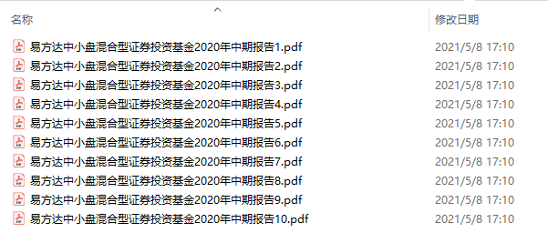
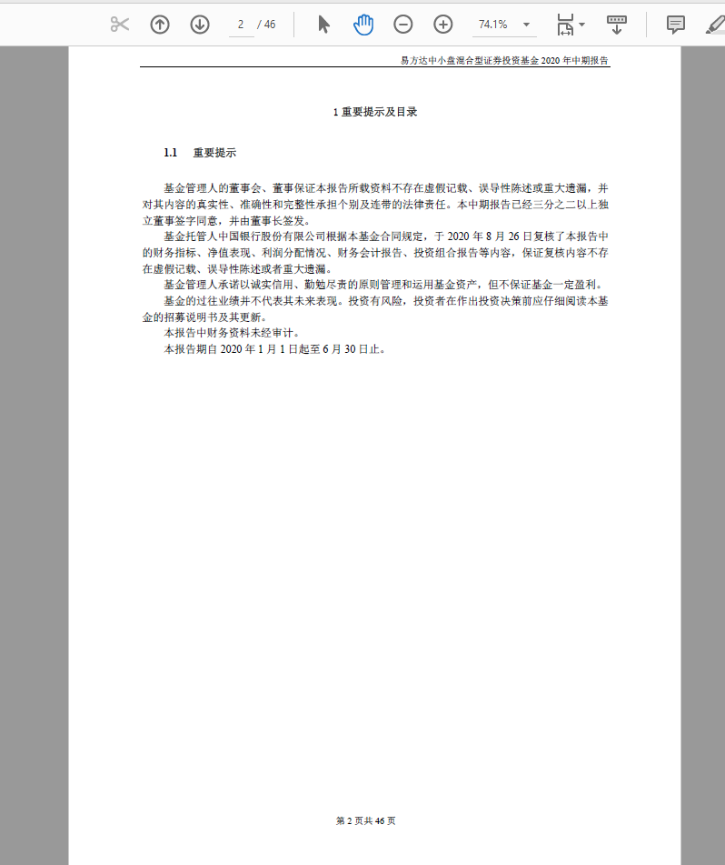
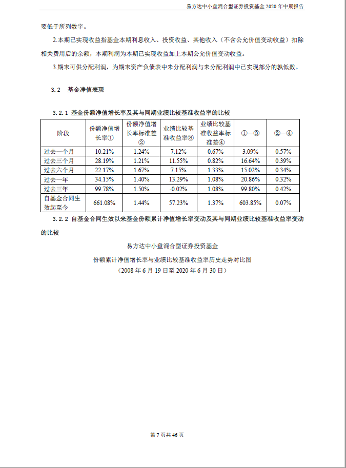

# Task 04 Python办公自动化--PDF篇

PDF 操作是的知识点，初级的 PDF 自动化包括 PDF 文档的拆分、合并、提取等操作，更高级的还包括 WORD与PDF互转等

初级操作一般比较常用，也可以解决较多的办公内容，所以本节将会主要介绍 PDF 的初级操作，具体内容将会从以下几个小节展开：

- [Task 04 Python办公自动化--PDF篇](#task-04-python办公自动化--pdf篇)
  - [4.1. 相关介绍](#41-相关介绍)
  - [4.2. 批量拆分](#42-批量拆分)
  - [4.3. 批量合并](#43-批量合并)
  - [4.4. 提取文字内容](#44-提取文字内容)
  - [4.5. 提取表格内容](#45-提取表格内容)
  - [4.6 提取图片内容](#46-提取图片内容)
  - [4.7 转换为图片](#47-转换为图片)
    - [4.7.1 安装 pdf2image](#471-安装-pdf2image)
    - [4.7.2 安装组件](#472-安装组件)
  - [4.8. 添加水印](#48-添加水印)
  - [4.9. 文档加密与解密](#49-文档加密与解密)

下面直接开始本节内容。


## 4.1. 相关介绍

Python 操作 PDF 会用到两个库，分别是：PyPDF2 和 pdfplumber

其中 **PyPDF2** 可以更好的读取、写入、分割、合并PDF文件，而 **pdfplumber** 可以更好的读取 PDF 文件中内容和提取 PDF 中的表格

对应的官网分别是：

> PyPDF2：https://pythonhosted.org/PyPDF2/
>
> pdfplumber：https://github.com/jsvine/pdfplumber

由于这两个库都不是 Python 的标准库，所以在使用之前都需要单独安装

win+r 后输入 cmd 打开 command 窗口，依次输入如下命令进行安装：

> pip install PyPDF2
>
> pip install pdfplumber

安装完成后显示 success 则表示安装成功


另外，在下文中需要用到两个文件：一个是本次教程的处理目标PDF、一个是在添加水印章节需要用到的水印PDF文件

其中第一个PDF大家可以换成自己想要处理的目标PDF，在下文的代码中修改相应的名称即可；第二个PDF大家可以根据文中给出的教程自行生成水印PDF文件（嫌麻烦的同学可以直接用我提供的水印PDF即可）

上述两个文件的下载链接如下：https://pan.baidu.com/s/10OpbHzyQBTWhJ9Rz7t1_BQ     提取码：1025

> 另外，需要注意的是，第一个PDF和第二个PDF直接放在运行代码的同级目录下即可，运行的时候无需创建文件夹，大家注意下！


## 4.2. 批量拆分

将一个完整的 PDF 拆分成几个小的 PDF，因为主要涉及到 PDF 整体的操作，所以本小节需要用到 PyPDF2 这个库

拆分的大概思路如下：

- 读取 PDF 的整体信息、总页数等
- 遍历每一页内容，以每个 step 为间隔将 PDF 存成每一个小的文件块
- 将小的文件块重新保存为新的 PDF 文件

需要注意的是，在拆分的过程中，可以手动设置间隔，例如：每5页保存成一个小的 PDF 文件

拆分的代码如下：

```python
import os
from PyPDF2 import PdfFileWriter, PdfFileReader

def split_pdf(filename, filepath, save_dirpath, step=5):
    """
    拆分PDF为多个小的PDF文件，
    @param filename:文件名
    @param filepath:文件路径
    @param save_dirpath:保存小的PDF的文件路径
    @param step: 每step间隔的页面生成一个文件，例如step=5，表示0-4页、5-9页...为一个文件
    @return:
    """
    if not os.path.exists(save_dirpath):
        os.mkdir(save_dirpath)
    pdf_reader = PdfFileReader(filepath)
    # 读取每一页的数据
    pages = pdf_reader.getNumPages()
    for page in range(0, pages, step):
        pdf_writer = PdfFileWriter()
        # 拆分pdf，每 step 页的拆分为一个文件
        for index in range(page, page+step):
            if index < pages:
                pdf_writer.addPage(pdf_reader.getPage(index))
        # 保存拆分后的小文件
        save_path = os.path.join(save_dirpath, filename+str(int(page/step)+1)+'.pdf')
        print(save_path)
        with open(save_path, "wb") as out:
            pdf_writer.write(out)

    print("文件已成功拆分，保存路径为："+save_dirpath)
    
filename = '易方达中小盘混合型证券投资基金2020年中期报告.pdf'
filepath = os.path.join(os.getcwd(), filename)
save_dirpath = os.path.join(os.getcwd(), '易方达中小盘混合型证券投资基金2020年中期报告【拆分】')
split_pdf(filename, filepath, save_dirpath, step=5)

```

以“易方达中小盘混合型证券投资基金2020年中期报告”为例，整个 PDF 文件一共 46 页，每5页为间隔，最终生成了10个小的 PDF 文件




**需要注意的是：**

如果你是第一次运行代码，在运行过程中报如下的错误，可以通过以下方法解决：


如果是在 Pycharm 下，直接通过报错信息，点击 utils.py 文件，定位到第 238 行原文

原文中是这样的：

```python
 r = s.encode('latin-1')
 if len(s) < 2:
   		bc[s] = r
 return r
```

修改为：

```python
try:
    r = s.encode('latin-1')
    if len(s) < 2:
        bc[s] = r
    return r
except Exception as e:
    r = s.encode('utf-8')
    if len(s) < 2:
        bc[s] = r
    return r
```

如果你使用的是 **anaconda**，对应的文件路径应该为：anaconda\Lib\site-packages\PyPDF2\utils.py，进行同样的修改操作即可


## 4.3. 批量合并

比起拆分来，合并的思路更加简单：

- 确定要合并的 **文件顺序**
- 循环追加到一个文件块中
- 保存成一个新的文件

对应的代码比较简单，基本不会出现问题：

```python
import os
from PyPDF2 import PdfFileReader, PdfFileWriter

def concat_pdf(filename, read_dirpath, save_filepath):
    """
    合并多个PDF文件
    @param filename:文件名
    @param read_dirpath:要合并的PDF目录
    @param save_filepath:合并后的PDF文件路径
    @return:
    """
    pdf_writer = PdfFileWriter()
    # 对文件名进行排序
    list_filename = os.listdir(read_dirpath)
    list_filename.sort(key=lambda x: int(x[:-4].replace(filename, "")))
    for filename in list_filename:
        print(filename)
        filepath = os.path.join(read_dirpath, filename)
        # 读取文件并获取文件的页数
        pdf_reader = PdfFileReader(filepath)
        pages = pdf_reader.getNumPages()
        # 逐页添加
        for page in range(pages):
            pdf_writer.addPage(pdf_reader.getPage(page))
    # 保存合并后的文件
    with open(save_filepath, "wb") as out:
        pdf_writer.write(out)
    print("文件已成功合并，保存路径为："+save_filepath)

filename = '易方达中小盘混合型证券投资基金2020年中期报告.pdf'
read_dirpath = os.path.join(os.getcwd(), '易方达中小盘混合型证券投资基金2020年中期报告【拆分】')
save_filepath = os.path.join(os.getcwd(), '易方达中小盘混合型证券投资基金2020年中期报告-合并后.pdf')
concat_pdf(filename, read_dirpath, save_filepath)

```


## 4.4. 提取文字内容

涉及到具体的 PDF 内容 操作，本小节需要用到 pdfplumber 这个库

在进行文字提取的时候，主要用到 extract_text 这个函数

具体代码如下：

```python
import os
import pdfplumber

def extract_text_info(filepath):
    """
    提取PDF中的文字
    @param filepath:文件路径
    @return:
    """
    with pdfplumber.open(filepath) as pdf:
        # 获取第2页数据
        page = pdf.pages[1]
        print(page.extract_text())
        
filename = '易方达中小盘混合型证券投资基金2020年中期报告.pdf'
filepath = os.path.join(os.getcwd(), filename)
# 提取文字内容
extract_text_info(filepath)

```

可以看到，直接通过下标即可定位到相应的页码，从而通过 extract_text 函数提取该也的所有文字

而如果想要提取所有页的文字，只需要改成：

```python
with pdfplumber.open(filepath) as pdf:
	# 获取全部数据
	for page in pdf.pages
    	print(page.extract_text())
```

例如，提取“易方达中小盘混合型证券投资基金2020年中期报告” 第一页的内容时，源文件是这样的：



运行代码后提取出来是这样的：


>  拓展一下：此处可以结合前面 word 小节，将内容写入 word 文件中


## 4.5. 提取表格内容

同样的，本节是对具体内容的操作，所以也需要用到 pdfplumber 这个库

和提取文字十分类似的是，提取表格内容只是将 extract_text 函数换成了 extract_table 函数

对应的代码如下：

```python
import os
import pandas as pd
import pdfplumber

def extract_table_info(filepath):
    """
    提取PDF中的图表数据
    @param filepath:
    @return:
    """
    with pdfplumber.open(filepath) as pdf:
        # 获取第18页数据
        page = pdf.pages[17]
        # 如果一页有一个表格，设置表格的第一行为表头，其余为数据
        table_info = page.extract_table()
        df_table = pd.DataFrame(table_info[1:], columns=table_info[0])
        df_table.to_csv('dmeo.csv', index=False, encoding='gbk')
        
filename = '易方达中小盘混合型证券投资基金2020年中期报告.pdf'
filepath = os.path.join(os.getcwd(), filename)
# 提取表格内容
extract_table_info(filepath)

```

上面代码可以获取到第 18 页的第一个表格内容，并且将其保存为 csv 文件存在本地

> 但是，如果说第 18 页有多个表格内容呢？

因为读取的表格会被存成二维数组，而多个二维数组就组成一个三维数组

遍历这个三位数组，就可以得到该页的每一个表格数据，对应的将 extract_table 函数 改成 extract_tables 即可

具体代码如下：

```python
import os
import pandas as pd
import pdfplumber

def extract_table_info(filepath):
    """
    提取PDF中的图表数据
    @param filepath:
    @return:
    """
    with pdfplumber.open(filepath) as pdf:
        # 获取第7页数据
        page = pdf.pages[6]
        # 如果一页有多个表格，对应的数据是一个三维数组
        tables_info = page.extract_tables()
        for index in range(len(tables_info)):
            # 设置表格的第一行为表头，其余为数据
            df_table = pd.DataFrame(tables_info[index][1:], columns=tables_info[index][0])
            df_table.to_csv('dmeo.csv', index=False, encoding='gbk')
        
filename = '易方达中小盘混合型证券投资基金2020年中期报告.pdf'
filepath = os.path.join(os.getcwd(), filename)
# 提取表格内容
extract_table_info(filepath)

```

以“易方达中小盘混合型证券投资基金2020年中期报告” 第 xx 页的第一个表格为例：

源文件中的表格是这样的：



提取并存入 excel 之后的表格是这样的：


## 4.6 提取图片内容

提取 PDF 中的图片和将 PDF 转存为图片是不一样的（下一小节），需要区分开。

提取图片：顾名思义，就是将内容中的图片都提取出来；转存为图片：则是将每一页的 PDF 内容存成一页一页的图片，下一小节会详细说明

转存为图片中，需要用到一个模块叫 fitz，fitz 的最新版 1.18.13，非最新版的在部分函数名称上存在差异，代码中会标记出来

使用 fitz 需要先安装 PyMuPDF 模块，安装方式如下：

> pip install PyMuPDF

提取图片的整体逻辑如下：

- 使用 fitz 打开文档，获取文档详细数据
- 遍历每一个元素，通过正则找到图片的索引位置
- 使用 Pixmap 将索引对应的元素生成图片
- 通过 size 函数过滤较小的图片

实现的具体代码如下：

```python
import os
import re
import fitz

def extract_pic_info(filepath, pic_dirpath):
    """
    提取PDF中的图片
    @param filepath:pdf文件路径
    @param pic_dirpath:要保存的图片目录路径
    @return:
    """
    if not os.path.exists(pic_dirpath):
        os.makedirs(pic_dirpath)
    # 使用正则表达式来查找图片
    check_XObject = r"/Type(?= */XObject)"
    check_Image = r"/Subtype(?= */Image)"
    img_count = 0

    """1. 打开pdf，打印相关信息"""
    pdf_info = fitz.open(filepath)
    # 1.16.8版本用法 xref_len = doc._getXrefLength()
    # 最新版本
    xref_len = pdf_info.xref_length()
    # 打印PDF的信息
    print("文件名：{}, 页数: {}, 对象: {}".format(filepath, len(pdf_info), xref_len-1))

    """2. 遍历PDF中的对象，遇到是图像才进行下一步，不然就continue"""
    for index in range(1, xref_len):
        # 1.16.8版本用法 text = doc._getXrefString(index)
        # 最新版本
        text = pdf_info.xref_object(index)

        is_XObject = re.search(check_XObject, text)
        is_Image = re.search(check_Image, text)
        # 如果不是对象也不是图片，则不操作
        if is_XObject or is_Image:
            img_count += 1
            # 根据索引生成图像
            pix = fitz.Pixmap(pdf_info, index)
            pic_filepath = os.path.join(pic_dirpath, 'img_' + str(img_count) + '.png')
            """pix.size 可以反映像素多少，简单的色素块该值较低，可以通过设置一个阈值过滤。以阈值 10000 为例过滤"""
            # if pix.size < 10000:
            #     continue

            """三、 将图像存为png格式"""
            if pix.n >= 5:
                # 先转换CMYK
                pix = fitz.Pixmap(fitz.csRGB, pix)
            # 存为PNG
            pix.writePNG(pic_filepath)
            
filename = '易方达中小盘混合型证券投资基金2020年中期报告.pdf'
filepath = os.path.join(os.getcwd(), filename)
pic_dirpath = os.path.join(os.getcwd(), '易方达中小盘混合型证券投资基金2020年中期报告【文中图片】')
# 提取图片内容
extract_pic_info(filepath, pic_dirpath)

```

以本节示例的“易方达中小盘混合型证券投资基金2020年中期报告” 中的图片为例，代码运行后提取的图片如下：


这个结果和文档中的共 1 张图片的 **结果符合**


## 4.7 转换为图片

转换为照片比较简单，就是将一页页的 PDF 转换为一张张的图片。大致过程如下：

### 4.7.1 安装 pdf2image

首先需要安装对应的库，最新的 pdf2image 库版本应该是 1.14.0

它的 github地址 为：https://github.com/Belval/pdf2image ，感兴趣的可以自行了解

安装方式如下：

> pip install pdf2image

### 4.7.2 安装组件

对于不同的平台，需要安装相应的组件，这里以 windows 平台和 mac 平台为例：

**Windows 平台**

对于 windows 用户需要安装 poppler for Windows，安装链接是：http://blog.alivate.com.au/poppler-windows/

另外，还需要添加环境变量， 将 bin 文件夹的路径添加到环境变量 PATH 中 

> 注意这里配置之后需要重启一下电脑才会生效，不然会报如下错误：

**Mac**

对于 mac 用户，需要安装 poppler for Mac，具体可以参考这个链接：http://macappstore.org/poppler/


详细代码如下：

```python
import os
from pdf2image import convert_from_path, convert_from_bytes

def convert_to_pic(filepath, pic_dirpath):
    """
    每一页的PDF转换成图片
    @param filepath:pdf文件路径
    @param pic_dirpath:图片目录路径
    @return:
    """
    print(filepath)
    if not os.path.exists(pic_dirpath):
        os.makedirs(pic_dirpath)

    images = convert_from_bytes(open(filepath, 'rb').read())
    # images = convert_from_path(filepath, dpi=200)
    for image in images:
        # 保存图片
        pic_filepath = os.path.join(pic_dirpath, 'img_'+str(images.index(image))+'.png')
        image.save(pic_filepath, 'PNG')
        
# PDF转换为图片
convert_to_pic(filepath, pic_dirpath)


filename = '易方达中小盘混合型证券投资基金2020年中期报告.pdf'
filepath = os.path.join(os.getcwd(), filename)
pic_dirpath = os.path.join(os.getcwd(), '易方达中小盘混合型证券投资基金2020年中期报告【转换为图片】')
# PDF转换为图片
convert_to_pic(filepath, pic_dirpath)
    
```

以本节示例的“易方达中小盘混合型证券投资基金2020年中期报告” 中的图片为例，该文档共 46 页，保存后的 PDF 照片如下：


一共 46 张图片


## 4.8. 添加水印

PDF 中添加水印，首先需要一个水印PDF文件，然后依次通过 mergePage 操作将每一页的 PDF 文件合并到水印文件上，据此，每一页的 PDF 文件将是一个带有水印的 PDF 文件

最后，将每一页的水印 PDF 合并成一个 PDF 文件即可

**生成水印**

生成水印的方式比较多，例如在图片添加水印，然后将图片插入到 word 中，最后将 word 保存成 PDF 文件即可

生成一张 A4 纸大小的空白图片，参考这篇文章：[Python 批量加水印！轻松搞定！](https://mp.weixin.qq.com/s/_oJA6lbsdMlRRsBf6DPxsg) 给图片添加水印，最终的水印背景图片是这样的：


然后将图片插入到 word 中并最终生成一个水印 PDF 文档

PDF 文档添加水印的主要代码如下：

```python
import os
from copy import copy
from PyPDF2 import PdfFileReader, PdfFileWriter

def add_watermark(filepath, save_filepath, watermark_filepath):
    """
    添加水印
    @param filepath:PDF文件路径
    @param save_filepath:最终的文件保存路径
    @param watermark_filepath:水印PDF文件路径
    @return:
    """
    """读取PDF水印文件"""
    # 可以先生成一个空白A4大小的png图片，通过 https://mp.weixin.qq.com/s/_oJA6lbsdMlRRsBf6DPxsg 教程的方式给图片加水印，将图片插入到word中并最终生成一个水印PDF文档
    watermark = PdfFileReader(watermark_filepath)
    watermark_page = watermark.getPage(0)

    pdf_reader = PdfFileReader(filepath)
    pdf_writer = PdfFileWriter()

    for page_index in range(pdf_reader.getNumPages()):
        current_page = pdf_reader.getPage(page_index)
        # 封面页不添加水印
        if page_index == 0:
            new_page = current_page
        else:
            new_page = copy(watermark_page)
            new_page.mergePage(current_page)
        pdf_writer.addPage(new_page)
    # 保存水印后的文件
    with open(save_filepath, "wb") as out:
        pdf_writer.write(out)

filename = '易方达中小盘混合型证券投资基金2020年中期报告.pdf'
filepath = os.path.join(os.getcwd(), filename)
save_filepath = os.path.join(os.getcwd(), '易方达中小盘混合型证券投资基金2020年中期报告-水印.pdf')
watermark_filepath = os.path.join(os.getcwd(), 'watermark.pdf')
# 添加水印
add_watermark(filepath, save_filepath, watermark_filepath)

```

以本节示例的“易方达中小盘混合型证券投资基金2020年中期报告” 为例，添加水印后的文档如下：


## 4.9. 文档加密与解密

你可能在打开部分 PDF 文件的时候，会弹出下面这个界面：


这种就是 PDF 文件被加密了，在打开的时候需要相应的密码才行

本节所提到的也只是基于 PDF 文档的加密解密，而不是所谓的 PDF 密码破解。

在对 PDF 文件加密需要使用 encrypt 函数，对应的加密代码也比较简单：

```python
import os
from PyPDF2 import PdfFileReader, PdfFileWriter

def encrypt_pdf(filepath, save_filepath, passwd='xiaoyi'):
    """
    PDF文档加密
    @param filepath:PDF文件路径
    @param save_filepath:加密后的文件保存路径
    @param passwd:密码
    @return:
    """
    pdf_reader = PdfFileReader(filepath)
    pdf_writer = PdfFileWriter()

    for page_index in range(pdf_reader.getNumPages()):
        pdf_writer.addPage(pdf_reader.getPage(page_index))

    # 添加密码
    pdf_writer.encrypt(passwd)
    with open(save_filepath, "wb") as out:
        pdf_writer.write(out)

filename = '易方达中小盘混合型证券投资基金2020年中期报告.pdf'
filepath = os.path.join(os.getcwd(), filename)
save_filepath = os.path.join(os.getcwd(), '易方达中小盘混合型证券投资基金2020年中期报告-加密后.pdf')
# 文档加密
encrypt_pdf(filepath, save_filepath, passwd='xiaoyi')

```

代码执行成功后再次打开 PDF 文件则需要输入密码才行

根据这个思路，破解 PDF 也可以通过暴力求解实现，例如：通过本地密码本一个个去尝试，或者根据数字+字母的密码形式循环尝试，最终成功打开的密码就是破解密码

> 上述破解方法耗时耗力，不建议尝试


另外，针对已经加密的 PDF 文件，也可以使用 decrypt 函数进行解密操作

解密代码如下：

```python
def decrypt_pdf(filepath, save_filepath, passwd='xiaoyi'):
    """
    解密 PDF 文档并且保存为未加密的 PDF
    @param filepath:PDF文件路径
    @param save_filepath:解密后的文件保存路径
    @param passwd:密码
    @return:
    """
    pdf_reader = PdfFileReader(filepath)
    # PDF文档解密
    pdf_reader.decrypt('xiaoyi')

    pdf_writer = PdfFileWriter()
    for page_index in range(pdf_reader.getNumPages()):
        pdf_writer.addPage(pdf_reader.getPage(page_index))

    with open(save_filepath, "wb") as out:
        pdf_writer.write(out)

filename = '易方达中小盘混合型证券投资基金2020年中期报告-加密后.pdf'
filepath = os.path.join(os.getcwd(), filename)
save_filepath = os.path.join(os.getcwd(), '易方达中小盘混合型证券投资基金2020年中期报告-解密后.pdf')
# 文档解密
decrypt_pdf(filepath, save_filepath, passwd='xiaoyi')
    
```

解密完成后的 PDF 文档打开后不再需要输入密码，如需加密可再次执行加密代码。

 **Task04 END.**

--- By: xiaoyi

>**Datawhale成员，数据分析从业者，金融风控爱好者**
>
>**公众号：小一的学习笔记**
